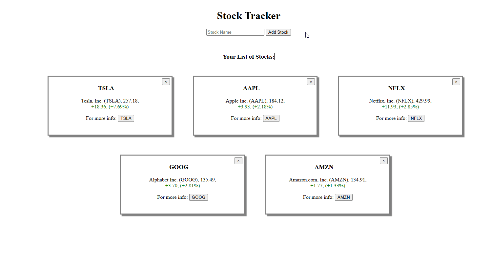

# Stock Tracker
A nodeJS application that helps you keep track of your stocks by saving them using Cookies

## Usage
After cloning the repo, run `node index.js` in the root directory

After reciving the output `listening on port 5000`, you can access the program at localhost:5000

---
